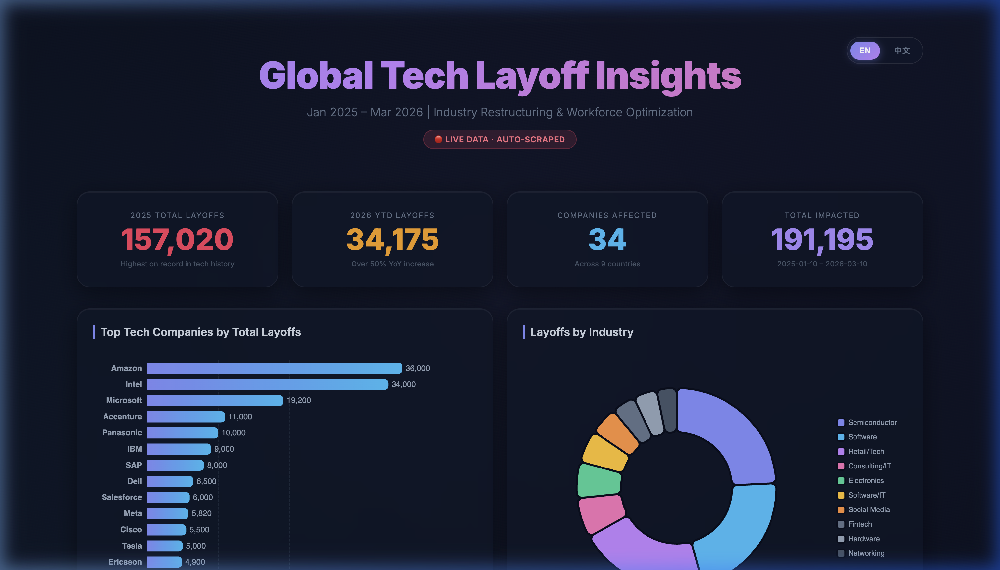

<div align="center">

# 🔍 Tech Layoff Tracker

### 全球科技行业裁员全景洞察 · 2025–2026

[](https://python.org)
[](https://www.crummy.com/software/BeautifulSoup/)
[](https://pandas.pydata.org/)
[](https://echarts.apache.org/)
[](Dockerfile)
[](.github/workflows/daily_update.yml)
[](LICENSE)

<br>

**An automated data pipeline that scrapes, processes, and visualizes global tech industry layoff data.**

*一个自动化数据管道，爬取、处理并可视化全球科技行业裁员数据。*

[Quick Start](#-quick-start) · [Features](#-features) · [Architecture](#-architecture) · [Data Sources](#-data-sources)

</div>

---

## 📸 Dashboard Preview

<div align="center">

### 🇺🇸 English Mode (Default)




### 🇨🇳 中文模式


> 💡 Supports **EN / 中文** language toggle — switch instantly without page reload.

</div>


---

## ✨ Features

| Feature | Description |
|---|---|
| 🕷️ **Web Scraper** | Multi-strategy scraper with Google Sheet CSV export, HTML parsing fallback, and offline sample data |
| 🧹 **Data Processing** | Pandas-based pipeline that cleans, normalizes, and aggregates raw data into analysis-ready JSON |
| 📊 **Interactive Dashboard** | Glassmorphism-styled ECharts dashboard with animated gradients and responsive layout |
| 🚀 **One-Command Pipeline** | `python main.py` runs the complete scrape → process → visualize workflow |
| 🐳 **Docker Ready** | Multi-stage Dockerfile + Compose — `docker compose up` for instant deployment |
| 🔄 **Offline-Capable** | Built-in curated dataset ensures the project works even without network access |

---

## 🚀 Quick Start

### Option A: Docker (Recommended) 🐳

```bash
# Clone & start — one command!
git clone https://github.com/frankwang0909/tech-layoff-tracker.git
cd tech-layoff-tracker
docker compose up --build
```

Open **http://localhost:8080/layoff_chart.html** in your browser. Done! 🎉

### Option B: Local Python

```bash
# Clone the repository
git clone https://github.com/frankwang0909/tech-layoff-tracker.git
cd tech-layoff-tracker

# Create virtual environment
python -m venv venv
source venv/bin/activate  # macOS/Linux

# Install dependencies
pip install -r requirements.txt

# Run the full pipeline
python main.py

# Serve the dashboard locally
python server.py
```

Open **http://localhost:8080/layoff_chart.html** or directly open `visualization/layoff_chart.html`.

### CLI Options

```bash
python main.py                  # Full pipeline: Scrape → Process → Chart
python main.py --skip-scrape    # Skip scraping, use existing data
python main.py --verbose        # Debug output
python server.py --port 3000    # Serve on custom port
```

---

## ⚙️ CI/CD: Daily Auto-Update

This project uses **GitHub Actions** to automatically update the data every day:

| Setting | Value |
|---|---|
| ⏰ **Schedule** | Daily at 08:00 UTC |
| 🔄 **Trigger** | Also runs on push to `main` and manual dispatch |
| 📊 **Pipeline** | Scrape → Process → Generate Chart |
| 💾 **Data** | Auto-committed back to the repo |
| 🌐 **Deploy** | Dashboard deployed to GitHub Pages |

### Setup Instructions

1. Push this repo to GitHub
2. Go to **Settings → Pages → Source** and select **GitHub Actions**
3. The workflow will run automatically — your dashboard will be live at:
   ```
   https://frankwang0909.github.io/tech-layoff-tracker/ 
   ```
4. To trigger manually: **Actions → Daily Layoff Data Update → Run workflow**


## 🏗️ Architecture

```
tech-layoff-tracker/
│
├── main.py                          # 🚀 One-command entry point
├── requirements.txt                 # Python dependencies
├── .gitignore
│
├── scraper/                         # 🕷️ Data Collection
│   ├── __init__.py
│   ├── config.py                    # Scraper configuration
│   └── layoffs_fyi_scraper.py       # Multi-strategy web scraper
│
├── analysis/                        # 🔧 Data Processing
│   ├── __init__.py
│   └── data_processor.py            # Clean, aggregate, export JSON
│
├── visualization/                   # 📊 Chart Generation
│   ├── generate_charts.py           # Jinja2 template → HTML dashboard
│   └── layoff_chart.html            # Generated interactive dashboard
│
├── data/
│   ├── raw/                         # Raw scraped CSV
│   └── processed/                   # Aggregated JSON files
│
└── reports/
    └── layoff_report_2025_2026.md   # Detailed analysis report (中文)
```

### Pipeline Flow

```
┌──────────────┐     ┌──────────────┐     ┌──────────────┐
│   SCRAPE     │────▶│   PROCESS    │────▶│  VISUALIZE   │
│              │     │              │     │              │
│ layoffs.fyi  │     │  pandas      │     │  Jinja2 +    │
│ Google Sheet │     │  aggregation │     │  ECharts     │
│ BeautifulSoup│     │  → JSON      │     │  → HTML      │
└──────────────┘     └──────────────┘     └──────────────┘
```

---

## 🕷️ Scraper Design

The scraper uses a **3-tier strategy** for maximum reliability:

| Priority | Strategy | Description |
|---|---|---|
| 1️⃣ | Google Sheet CSV | Direct download from the public Google Sheet backing layoffs.fyi |
| 2️⃣ | HTML Parsing | BeautifulSoup fallback — parse tables and embedded JSON from the page |
| 3️⃣ | Offline Dataset | Curated sample data from verified public reports (always works) |

**Ethical scraping practices:**
- Polite request delays (`REQUEST_DELAY = 1.0s`)
- Proper `User-Agent` header
- Configurable retry with backoff
- Only targets publicly available data

---

## 📊 Key Findings

### 2025 — Record-Breaking Year
- **~245,000** tech workers laid off globally
- **69.7%** concentrated in the United States
- Top impacted: Amazon (36K), Intel (34K), Microsoft (19K)

### 2026 (Jan–Mar) — Accelerating Trend
- **>45,000** laid off in the first ~2.5 months
- **51% increase** year-over-year
- Projected to exceed 2025 if pace continues

### Root Causes
- 🤖 **AI & Automation** (~30%) — Structural workforce shift
- 📉 **Economic Uncertainty** (~45%) — Inflation, high rates
- 🦠 **Post-Pandemic Correction** (~15%) — Overhiring correction
- 🔄 **Business Restructuring** (~10%) — Strategic pivots (e.g., Meta: VR → AI)

---

## 📁 Data Sources

- [layoffs.fyi](https://layoffs.fyi/) — Primary tech layoff tracker
- RationalFX Annual Reports
- Major tech press: Reuters, Bloomberg, CNBC, The Verge, TechCrunch
- Company press releases and SEC filings

---

## 🛠️ Tech Stack

- **Scraping**: `requests`, `BeautifulSoup4`, `lxml`
- **Processing**: `pandas`
- **Templating**: `Jinja2`
- **Visualization**: `ECharts 5.x` (client-side)
- **Language**: Python 3.10+

---

## 📄 License

This project is licensed under the MIT License — see the [LICENSE](LICENSE) file for details.

---

<div align="center">

**If you found this project useful, please consider giving it a ⭐!**

</div>
